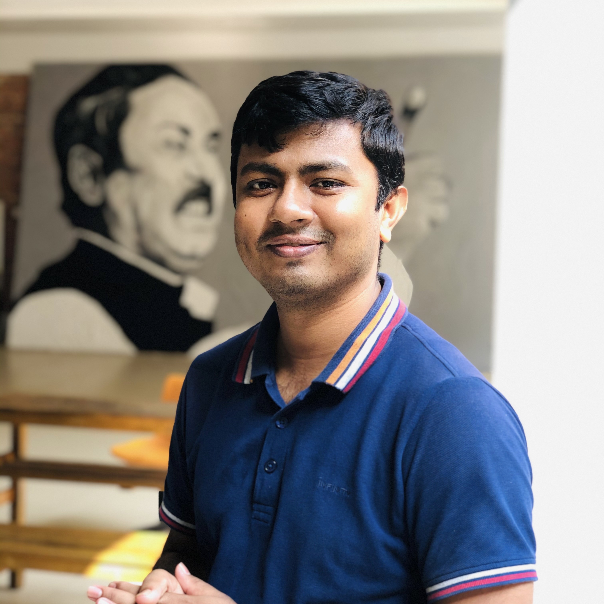
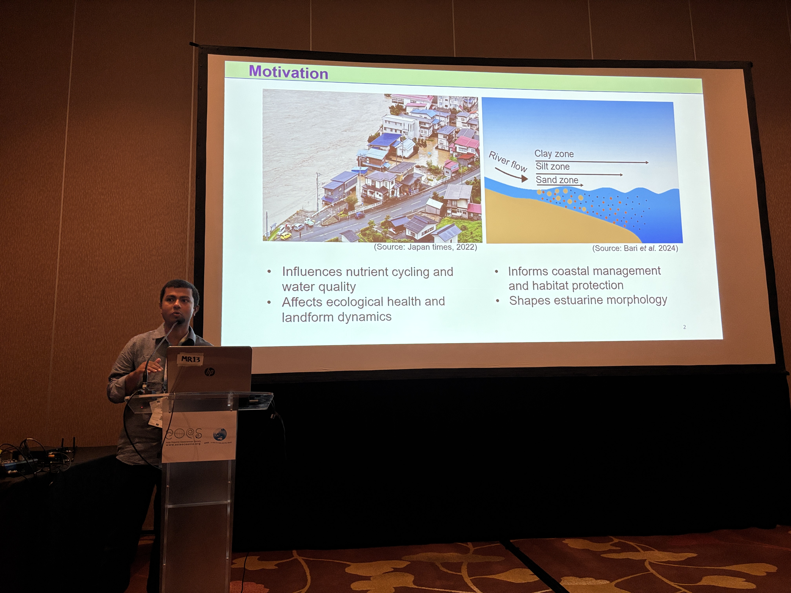

<!-- ========== TOP NAVBAR (RESPONSIVE & COLLAPSIBLE) ========== -->

  <input type="checkbox" id="nav-toggle" class="nav-toggle">
  <label for="nav-toggle" class="nav-toggle-label">☰ Menu</label>

  

    <a href="#about">About</a>
    <a href="#research-interests">Research</a>
    <a href="#whats-new">News</a>
    <a href="#publications">Publications</a>
    <a href="#talks">Talks</a>
    <a href="#service">Service</a>
    <a href="#contact">Contact</a>
  

<!-- ========== HERO SECTION ========== -->

  

<h1 align="center" style="font-weight: 700; margin-top: -10px;">Sheikh Hefzul Bari</h1>

  <strong>PhD Candidate in Hydrology</strong>, Fukushima University, Japan  

  <em>Suspended sediment dynamics • Climate change • Compound flooding • River continuum</em>

<!-- ========== ABOUT ME ========== -->

## About {#about}

I study hydrology and fluvial–coastal systems in a changing climate, focusing on how hydrological and geomorphological processes shape suspended sediment dynamics from mountain headwaters to river mouths. My research also explores extreme events, with the aim of developing data-driven hazard assessment tools and resilience-oriented adaptation strategies. I am currently a <b>PhD candidate at Fukushima University</b>, supervised by <b>Prof. Yoshiyuki Yokoo</b>.

<!-- ========== RESEARCH INTERESTS ========== -->

## Research interests {#research-interests}

- Climate change and hydrological impacts  
- Suspended sediment dynamics (from mountains to estuary)  
- Fluvial and pluvial flooding  
- Open-source tools for hydro-sediment analysis  

<!-- ========== NEWS / HIGHLIGHTS ========== -->

## What's New {#whats-new}

  

**2025 —** Presented my ongoing research at the *Asia Oceania Geosciences Society (AOGS)* Annual Meeting in Singapore.

<!-- ========== SELECTED PUBLICATIONS ========== -->

## Selected publications {#publications}

1. **S H Bari**, M Tateno, Y Yokoo, C Leong (2025). Dynamics, particle size distribution and mineral composition of suspended sediment transport in the Abukuma River estuary. *Hydrological Research Letters*, 19(1):51–57. [DOI](https://doi.org/10.3178/hrl.24-00028)
2. **Bari SH**, Yokoo Y, Leong C (2024). Recent global trends in suspended sediment estimation studies. *Hydrological Research Letters*, 18(2):51–57. [DOI](https://doi.org/10.3178/hrl.18.51)
3. Husna NEA, **Bari SH**, Islam GT, Islam AS, Hussain MM (2024). Modelling drought as a climate change indicator in the southwest coastal region of Bangladesh. *Int. J. of Hydrology Science and Technology*, 18(4):351–367. [DOI](https://doi.org/10.1504/IJHST.2024.142022)
4. **Bari SH**, Hoque MA, Rahman MT, Hussain MM (2016). Seasonal and annual rainfall trends in northern Bangladesh. *Atmospheric Research*, 176–177:148–158. [DOI](https://doi.org/10.1016/j.atmosres.2016.02.008)

[**Full publication list →**](https://sites.google.com/view/shbari/publications?authuser=0)

<!-- ========== TALKS & OUTREACH ========== -->

## Talks & outreach {#talks}

- A reconnaissance study on estuarine suspended sediment dynamics in the Abukuma River, Japan. *Japan Geoscience Union (JpGU) Meeting*, 2025 (Invited Talk)

- Suspended sediment dynamics in the Abukuma River estuary: Composition, particle size, hysteresis. *AOGS Annual Meeting*, 2025, Singapore.

<!-- ========== SERVICE & MEMBERSHIPS ========== -->

## Service & memberships {#service}

**Memberships**  
1. Japan Society of Hydrology and Water Resources  
2. Japan Geoscience Union (JpGU)  
3. International Association of Hydrological Sciences (IAHS)

**Editorial Activities**  
- Reviewer for multiple peer-reviewed journals

<!-- ========== CONTACT & FOOTER ========== -->

## Contact {#contact}

  

  © 2025 Sheikh Hefzul Bari • Licensed under  
  <a href="https://creativecommons.org/licenses/by/4.0/">CC BY 4.0</a>

Last updated: 2025-11-24
